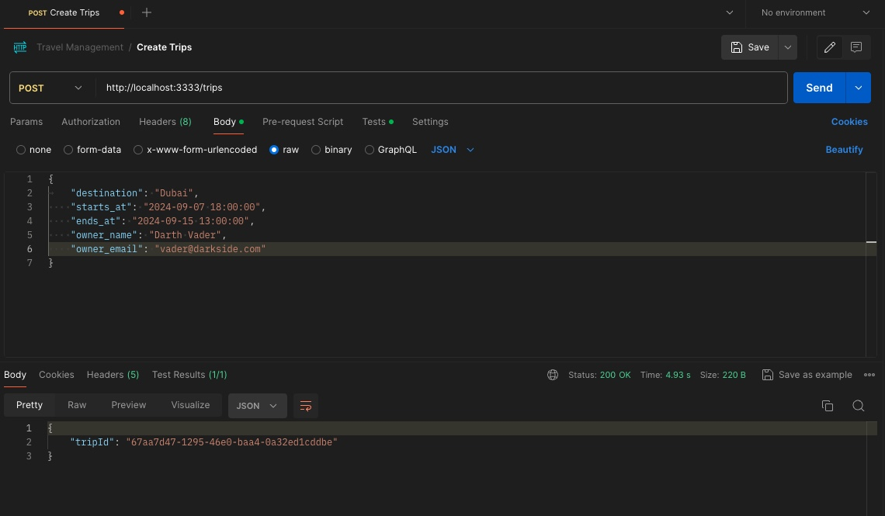

# Gerenciamento de Viagens

## Sobre o Projeto

O projeto consiste no backend de uma aplicação para gerenciamento de viagens, onde um indivíduo cria uma viagem estipulando datas e o lugar e consegue enviar o convite por e-mail para outras pessoas. 

## Rotas do Projeto

Abaixo estão algumas rotas do projeto. Não irei colocar todas as rotas pois iria ficar muito extenso. Abaixo das imagens está a descrição do que ela representa.

A imagem acima mostra a rota de criação de uma viagem e a geração do ID dela.

Nessa outra imagem, já está a inserção do responsável pela viagem.

Vemos aqui o registro da criação da viagem no Bando de Dados, no caso o SQLite, através do Prisma Studio.

Aqui consta a URL para acessar o e-mail enviado para teste. No projeto o servidor SMTP é um "fake" SMTP, no caso o nodemailer/ethereal, pois geralmente esse serviço é pago.

E-mail de teste aberto através da URL indicada na imagem acima.

## Tecnologias utilizadas

- Node.js
- Etheral (Servidor SMTP)
- TypeScript
- Fastify
- Zod
- Prisma ORM
- SQLite